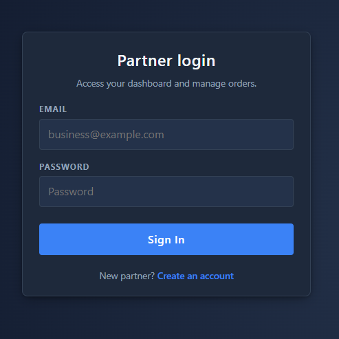

## 🚀 Features

### 🔐 Authentication & Authorization
- JWT-based authentication
- Secure protected routes
- Role-based access control (User / Food Partner)
- 
## User Features
- User registration & login
- Food partner registration & login
- Reels view with likes & saves
- Visit store & save food

- ### 🏪 Food Partner Features
- Add new food items
- Manage their own food listings

## 🛠 Tech Stack

### Frontend
- React
- JavaScript
- HTML & CSS
- Axios

### Backend
- Node.js
- Express.js
- MongoDB
- JWT (JSON Web Token)
- bcrypt (for password hashing)
-  Role-based middleware

## 📸 Screenshots

## Screenshots

### 👤 User
**Register**  

**Login**  

**Reels**  

---

### 🍽️ Food Partner
**Register**  

**Login**  

**Add Item**  

