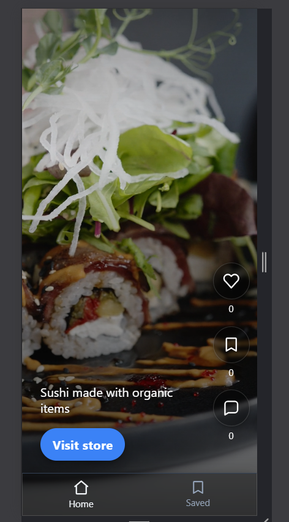
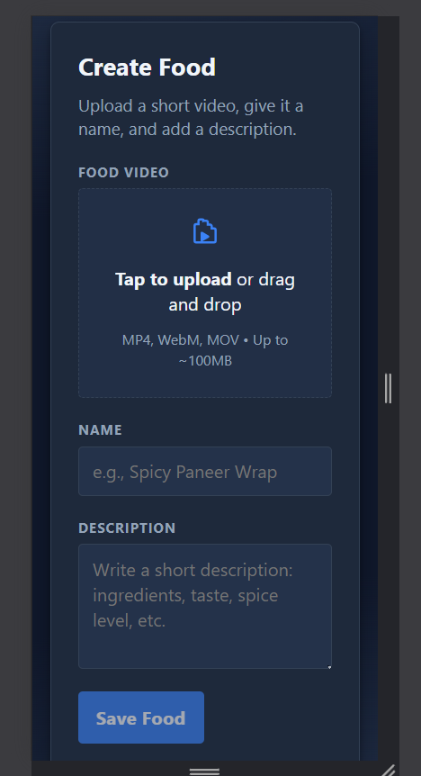

## 🚀 Features

### 🔐 Authentication & Authorization
- JWT-based authentication
- Secure protected routes
- Role-based access control (User / Food Partner)
- 
## User Features
- User registration & login
- Food partner registration & login
- Reels view with likes & saves
- Visit store & save food

- ### 🏪 Food Partner Features
- Add new food items
- Manage their own food listings

## 🛠 Tech Stack

### Frontend
- React
- JavaScript
- HTML & CSS
- Axios

### Backend
- Node.js
- Express.js
- MongoDB
- JWT (JSON Web Token)
- bcrypt (for password hashing)
-  Role-based middleware

## 📸 Screenshots

<h2>📸 Screenshots</h2>

<h3>👤 User</h3>

  
  
  

<h3>🍽️ Food Partner</h3>

  
  
  

